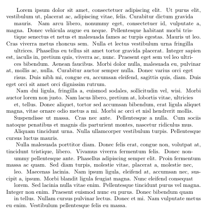

# Zigzag Text Alignment

When reading a justified paragraph  with  many  lines,  sometimes  we mislocate  the  next  line and either reread the same line or skip the subsequent line. To address this shortcoming, this work introduces a new zigzag-style typographic alignment. In this zigzag alignment style we propose to maintain the justification but arrange the lines in a zigzag style. Here's the simple example of this style using our zigzag package.

## How to use it in Overleaf (Latex)?
* Include the `zigzag.sty` file in your Overleaf project
* Import the package using `\usepackage(zigzag)`
* Apply the command using `\zigzagpar{paragraph.....}`

## Example Overleaf Report 
* An Overleaf project example is [here](https://www.overleaf.com/read/sqntjzwhrrbs).
